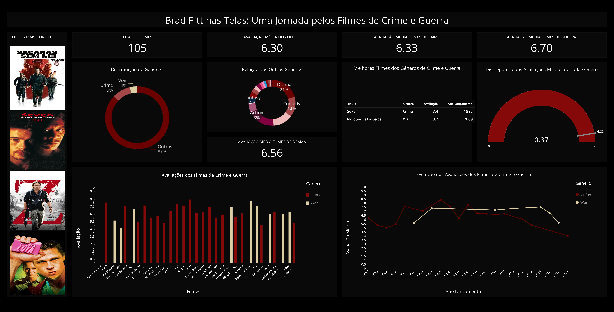

# Data Pipeline & Dashboard

Projeto desenvolvido durante meu estágio na **Compass UOL**, em um programa de formação em **Engenharia de Dados com AWS**. Como etapa final, cada grupo recebeu um tema para análise; o tema do grupo foi **filmes de crime e guerra**, e o recorte escolhido para este projeto foi a **carreira de Brad Pitt**.

>A solução simula um fluxo completo de **Data Lake**, desde a ingestão dos dados até seu processamento, modelagem, análise e visualização.

## Arquitetura do Pipeline

```text
CSV / API TMDB
      │
      ▼
   Amazon S3
    RAW Zone
      │
      ▼
AWS Glue + Spark
      │
      ▼
 Trusted Zone
      │
      ▼
AWS Glue + Spark
      │
      ▼
 Refined Zone
      │
      ▼
 Amazon Athena
      │
      ▼
  QuickSight
      │
      ▼
   Dashboard
```

## Fluxo do Projeto

### 1. Ingestão de Dados

Os dados provenientes de arquivos **CSV** foram armazenados no **Amazon S3**, formando a camada RAW. A ingestão foi realizada utilizando **Python em Docker**.

Também foi desenvolvida uma função em **AWS Lambda** para realizar consultas à **API do TMDB**, armazenando os dados retornados em formato JSON no S3.

### 2. Processamento

Os dados da camada RAW foram processados utilizando **AWS Glue e Apache Spark**, realizando limpeza, padronização, seleção de informações relevantes e particionamento.

Na camada **Trusted**, foram selecionados os filmes relacionados à análise da carreira de Brad Pitt, considerando informações como:

``título``
``gênero``
``data de lançamento``
``avaliação``

### 3. Modelagem

Na camada **Refined**, os dados foram novamente processados e organizados utilizando o modelo **Snowflake**.

As tabelas resultantes foram disponibilizadas no **AWS Glue Catalog** e utilizadas no **Amazon Athena** para consultas e criação de views direcionadas às análises.

## Dashboard

O resultado da análise foi apresentado em um dashboard desenvolvido no **Amazon QuickSight**, reunindo as principais métricas e visualizações sobre a carreira de Brad Pitt em filmes de crime e guerra.



## Perguntas de Análise

1. Como as avaliações dos filmes de crime e guerra se comparam?
2. Quais gêneros aparecem com maior frequência na carreira analisada?
3. Como as avaliações evoluíram ao longo do tempo?
4. Existem discrepâncias relevantes entre as avaliações dos filmes?

## Tecnologias

**Python · Docker · Amazon S3 · AWS Lambda · AWS Glue · Apache Spark · Amazon Athena · Amazon QuickSight · TMDB API · SQL**

## Conceitos Aplicados

**Data Lake · ETL · ingestão de dados · integração com APIs · processamento distribuído · particionamento · modelagem Snowflake · consultas SQL · análise de dados · visualização de dados**
